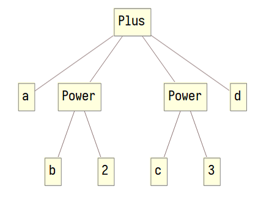

================
形式文法
================

--------------------
符号的形式模型
--------------------
符号的形式模型是前缀树（trie）：

借助括号就可以用文字表示它（我习惯使用方括号）：

``Plus[a, Power[b, 2], Power[c, 3], d]``

在上式中 ``Plus`` 、 ``Power`` 总是位于括号的前面，我约定称：「 ``Power`` 是 ``Power[b,2]`` 这个 **符号式** 的 **头部**」。在图片中它们则处于树的根部，这个说法很形象但我将不采用。
``a`` 、 ``Power[b,2]`` 等位于括号内部，我约定称： ``b`` 和 ``2`` 是符号表达式 ``Power[b,2]`` 的 **子式** 。按照这个说法， ``a`` ``Power[b, 2]`` ``Power[c, 3]`` ``d`` 则是整个式子的子式 。在树的比喻中，子式的概念对应于树的分枝。

尽管 ``a`` ``2`` 这样的符号没有任何分支，但我约定：仍称它是一个符号式，只不过它是一个不可进一步分解的 **原子式** 。不是原子式的式子称为 **复合式** 。在树的比喻中，复合式中包含的各个原子式是这个复合式的叶子。

上面的字符序列并不是一个EAL句子，而是只用于表示句子背后的形式模型，能方便讨论。
画图是比较费力的，以后我都将使用这种“平坦”的方法。
另有一套更合适的序列化方法来生成真正的EAL句子，那将比较接近于自然语言的样子，而且比较适合人类识别、书写、发音。

--------------------
符号式的语义解释
--------------------
EAL词汇表中，会写有类似下面的 **符号定义** ：

``Friend : Friend[x, y] = "x和y是朋友"``

如果再引入两个新的定义：

``I : I = "我"``

``He : He = "他"``

我们就可以用 ``Friend[I, He]`` 来表达「我和他是朋友」了。

第一条定义中，我约定： ``Friend`` 称为 **定义绑定的对象符号** ，``Friend[x, y]`` 称为 **定义对象** ，称 **"x和y是朋友"** 为 **语义** 。
在这条定义中，出现了 ``x`` ``y`` 这种无实际语义的符号，这类似编程语言中常说的「函数的形式参数」，这里我约定称它们是 **语义模板的插槽** 。

可以看到，后两条定义中没有这样的插槽，定义的对象是符号本身，这两个定义就没有什么「模板」的意味。

^^^^^^^^^^^^^^^^^^^^^^^^^^^^^^
嵌套的符号式的解释
^^^^^^^^^^^^^^^^^^^^^^^^^^^^^^
"""""""""""""""""""""
返回所进行的陈述
"""""""""""""""""""""
定义

``Know : Know[x, y] = "x知道y"``

两层的嵌套式 ``Know[I, Know[I, He]]`` 的语义是「我知道「我知道他」这事」。

可以看出，定义中的插槽 ``y`` 可以被另一个表达式 ``Know[I, He]`` 填充，意为「「我知道他」这事」。

在解释外层的 ``Know`` 时，内层的子式将一个式子及其语义 **返回** 给了外层。
在上例中，内层式子的 **返回式** 是 ``Know[I, He]`` 整体， **返回语义** 是「「我知道他」这事」。

``Know[I, He]`` 之所以解释为「「我知道他」这事」，是因为这是一项通用的约定，一个式子作为返回式时的语义将是一个陈述。
形式上说，这相当于有这样一个全局的语义定义：

``f[g[a,b]] = f["g[a,b]这事"]``

"""""""""""""""""""""
返回子式
"""""""""""""""""""""

一个式子不但可以返回它所表达的陈述，还可以 *在完成陈述后* 返回这个陈述中所涉及的对象：

两层的嵌套式 ``Know[I, Know1[He, She]]`` 的语义是「我知道他，他知道她」。
其中， ``Know1`` 末尾的标记 ``1`` 表明返回值是 ``Know1[He, She]`` 的第一个子式 ``He`` ，其语义是「他」。

EAL还允许你在符号后添加标记 ``2`` ，``Know2[He, She]`` 返回它的第二个子式 ``She``。

语义模板通常只有一两个重要的插槽，所以EAL只支持返回前两个子式。算上无标记的情况，一共有三种返回式。

^^^^^^^^^^^^^^^^^^^^^^^^^^^^^^
缺失插槽的语义模板的解释
^^^^^^^^^^^^^^^^^^^^^^^^^^^^^^
"""""""""""""""""""""""""
返回式处于缺失插槽的情况
"""""""""""""""""""""""""

实际的EAL词汇表中没有「我」、「他」这样的“名词性”的词，EAL词汇表中的 *几乎* 所有定义都采用「语义模板」，而不是以符号这个原子式为定义对象。
如果任何符号本身没有语义，那么在有语义的式子中，所有符号都只能位于式子的头部。
你可能会好奇：一个没有“名词”的语言要如何使用？ ``Friend[x, y]`` 的插槽 ``x`` ``y`` 如果不能由 ``Me`` 这样的符号填充，又要由什么来填充呢？

实际上，EAL中只有这样的定义：

``IsMe : IsMe[x] = "x是我"``

要表达「我和他是朋友」，需用此式： ``Friend[IsMe1[], IsHim1[]]`` 。

可以注意到，语义模板中有一个插槽，但在式中却没有填充这个插槽。不但如此，还添加了标记 ``1`` 来要求返回这个未提供的子式。

对于 ``IsMe[]`` 这种缺失插槽的语义模板，解释过程中会创建一个 **变量** 。如，解释 ``IsMe1[]`` 的过程是:

#. 创建一个变量，此处记作 ``a``
#. 陈述「 ``a`` 是我」
#. 返回 ``a`` 给外层表达式

解释 ``Friend[IsMe1[], IsHe1[]]`` 时，一共进行了「 ``x`` 是我」、「 ``y`` 是他」、「 ``x`` 和 ``y`` 是朋友」三个陈述。

EAL不直接为事物起名字，但有摹状词。当摹状词的描摹对象被省略，我们就能利用返回机制将对象返回来代表事物。

"""""""""""""""""""""""""""
返回式不处于缺失插槽的情况
"""""""""""""""""""""""""""
要表示「我理解（什么是）朋友关系」，需用此式： ``Know[IsMe1[], Friend[]]`` 。

``Friend`` 没有任何子式，这时返回式是 **抽象** 的，表达「朋友关系」。

	在一阶逻辑模型中，谓词本身是不可量化的，也就不存在更抽象的高阶谓词。
	这时，返回式表达的也不是语义模板本身，而是两个插槽都被全称量化后的朋友关系命题，「我理解朋友关系」的含义应是「我理解所有的朋友关系命题」。
	EAL不试图声称自己是一阶逻辑模型，也就是说形式上允许对谓词的量化，所以你可以将上式的返回语义认为是抽象的「朋友关系」本身。

//巨坑待填：模糊状态与类

"""""""""""""""""""""
不唯一的指称对象
"""""""""""""""""""""
``Friend2[IsMe1[]]`` 的返回语义是「我的朋友」。
但能令 ``Friend[Me, x]`` 成立的 ``x`` 可以有多个，这个返回语义的指称对象究竟是我的哪一个朋友？

EAL这样约定：使用标记 ``1`` 和 ``2`` 时，就已默认返回值是唯一的，也就是说进行了唯一存在量化。
从而 ``Friend2[IsMe1[]]`` 的确切的返回语义是「我那唯一的朋友」。

若要表达「我的每个朋友」，需额外添加全称量化的标记 ``A`` 。也就是说「我的每个朋友」要由 ``Friend2A[IsMe1[]]`` 来表示。

特称量化标记则是 ``E`` 。「我有个朋友死了」记作 ``IsDead[Friend2E[IsMe1[]]]`` 

//巨坑待填：模糊状态与类

^^^^^^^^^^^^^^^^^^^^
选项
^^^^^^^^^^^^^^^^^^^^

--------------------
符号式的序列化方案
--------------------

^^^^^^^^^^^^^^^^^^^^
文法
^^^^^^^^^^^^^^^^^^^^

^^^^^^^^^^^^^^^^^^^^
发音
^^^^^^^^^^^^^^^^^^^^
